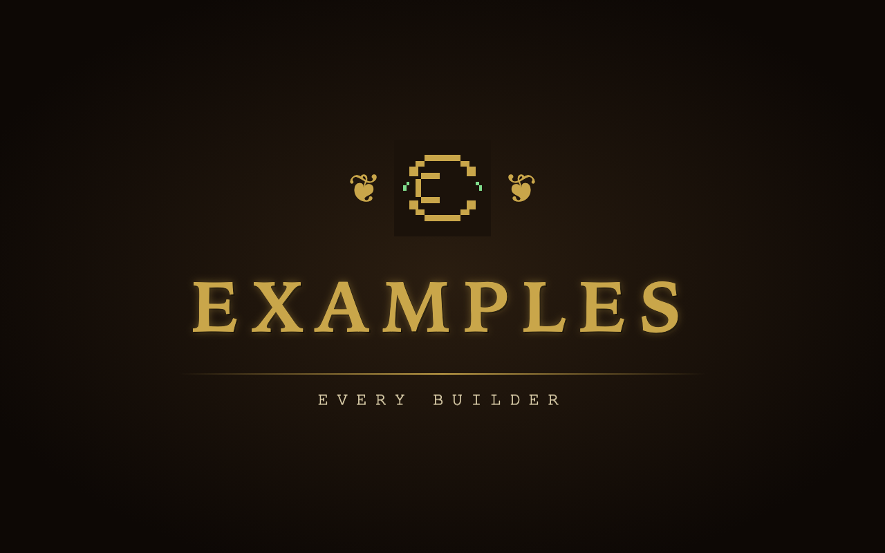
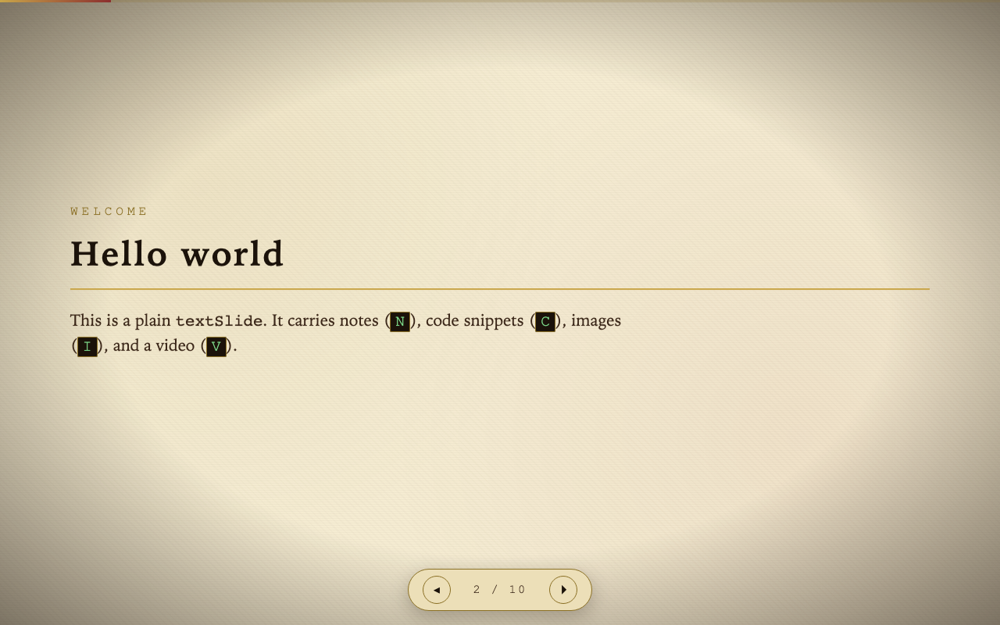
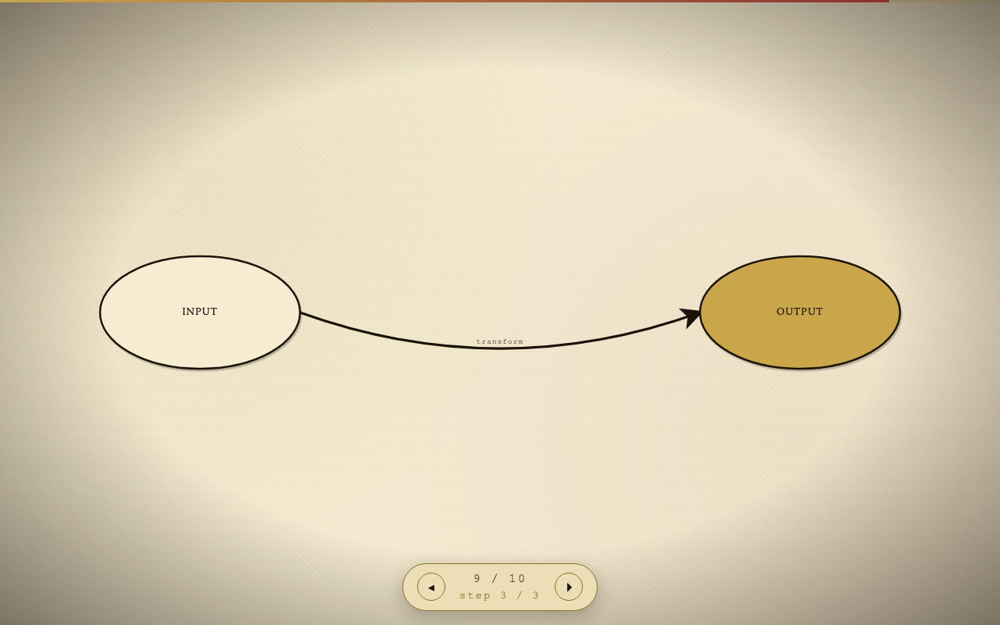
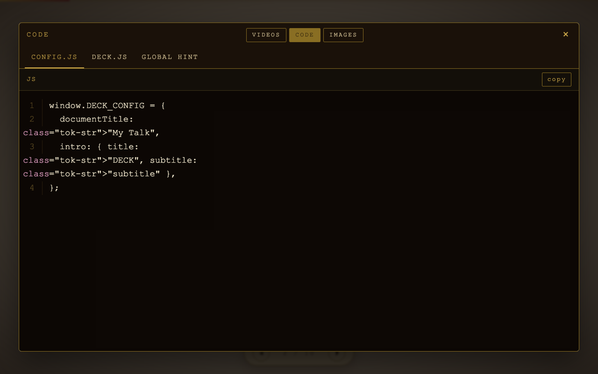
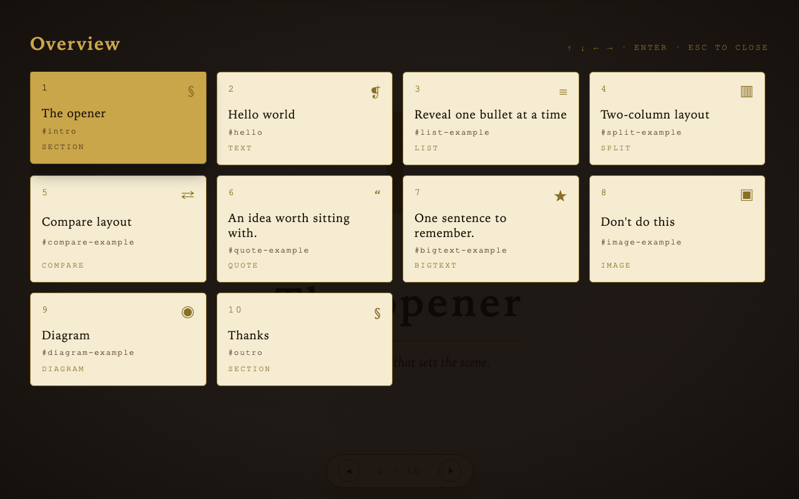

# Claudius Academy

> A vanilla-JS presentation engine for browser-native talks.
> No build step, no framework, no `node_modules`. Open `index.html` and present.
> Comes with a parchment + pixel default theme — fully overridable per deck.

[](https://github.com/gchalikio/claudius-academy/actions/workflows/test.yml)
[](LICENSE)
[](CHANGELOG.md)
[](#quick-start)
[](CONTRIBUTING.md)

Claudius Academy is a single-folder presentation engine you can fork to give
talks that *look* designed without touching a slide tool. The engine in
`js/` and `css/` is **theme-agnostic** — it ships with a parchment + pixel
default look, but every color, font, and layout token is overridable per
deck via CSS variables (`config.theme`), `@font-face` injection
(`config.fonts`), and an optional per-deck stylesheet
(`presentations/<deck>/theme.css`). Slide types include text, quotes,
lists, splits, comparisons, big-text, images with a "no" overlay, and
progressive SVG diagrams that draw themselves step by step. Speaker
notes, an overview grid, a talk timer, and video/code modals all ship in
the box.

> **You don't need to be a developer to use this.** The repo ships with a
> full set of [Claude Code skills](.claude/skills/) — opening it in any
> AI-aware editor (Claude Code, Cursor, etc.) lets you say things like
> *"start a new deck called Q4 review"* or *"add a diagram showing X"* and
> the AI does the editing. The skills encode every common flow as concrete
> steps, so the AI never has to guess.

---

## Table of contents

- [Quick start](#quick-start)
- [Screenshots](#screenshots)
- [Project structure](#project-structure)
- [Authoring a new deck](#authoring-a-new-deck)
- [Slide builders](#slide-builders)
  - [Builder reference (with examples)](#builder-reference-with-examples)
  - [Custom builders](#custom-builders)
- [Key bindings](#key-bindings)
- [Configuration](#configuration)
- [Theming](#theming)
- [Tests](#tests)
- [Contributing](#contributing)
- [Code of conduct](#code-of-conduct)
- [Security](#security)
- [AI-friendly](#ai-friendly)
- [Editor support](#editor-support)
- [Acknowledgments](#acknowledgments)
- [License](#license)

---

## Quick start

```bash
# Option A — open the file directly
open index.html

# Option B — serve it (recommended for the dynamic deck loader)
python3 -m http.server 8000
# then visit http://localhost:8000
```

When you visit the bare URL, a picker shows the registered decks.
Visit `index.html?deck=<deck-id>` to skip the picker.

---

## Screenshots

> Drop screenshots into `docs/screenshots/` and the placeholders below will
> render them. Suggested set: `intro.png`, `slide.png`, `diagram.png`,
> `code-modal.png`, `overview.png`.

| | |
| :---: | :---: |
|  |  |
| **Default intro animation** | **A text slide** |
|  |  |
| **Progressive SVG diagram** | **Code modal (press `C`)** |
|  | |
| **Overview grid (press `Esc`)** | |

---

## Project structure

```
.
├── index.html                  ← entry point, loads engine + loader
├── css/                        ← engine styles (theme tokens, slide layouts, modals…)
├── js/                         ← engine code
│   ├── router.js               ← slide + step navigation
│   ├── diagram.js              ← progressive SVG diagram engine
│   ├── builders.js             ← reusable slide constructors
│   ├── modal.js  code.js       ← video and code-snippet modals
│   ├── notes.js  overview.js   ← speaker notes pane and overview grid
│   ├── timer.js                ← talk timer
│   ├── intro.js                ← opening sequence
│   ├── nav.js                  ← keyboard + button bindings
│   ├── loader.js               ← picks and loads a deck
│   └── main.js                 ← boot
├── assets/                     ← shared assets (default logo, placeholder image)
├── presentations/              ← every deck lives here
│   ├── index.js                ← public registry of available decks
│   ├── local.js                ← gitignored, registers personal decks
│   └── examples/               ← public showcase deck (every builder)
│       ├── config.js           ← branding, theme, fonts, hints, timer
│       ├── deck.js             ← slide content
│       ├── theme.css           ← optional per-deck CSS overrides
│       └── assets/             ← per-deck images, fonts, videos
├── tests/                      ← Playwright smoke + integration tests
├── docs/screenshots/           ← drop README screenshots here
├── .claude/skills/             ← reusable skills for AI assistants
├── .github/                    ← CI workflow, issue & PR templates, CODEOWNERS
├── CLAUDE.md                   ← project context for AI tools
├── CHANGELOG.md  CONTRIBUTING.md  CODE_OF_CONDUCT.md  SECURITY.md  LICENSE
└── types.d.ts                  ← editor type hints (no build step required)
```

---

## Authoring a new deck

```bash
cp -r presentations/examples presentations/my-talk
```

1. Edit `presentations/my-talk/config.js` — title, intro text, theme, fonts.
2. Edit `presentations/my-talk/deck.js` — your slides.
3. Register it in `presentations/index.js`:
   ```js
   window.DECKS = [
     { id: "claudius-academy", title: "Claudius Academy" },
     { id: "my-talk",          title: "My Talk" },
   ];
   ```
4. Open `index.html?deck=my-talk`.

---

## Slide builders

All built-in builders live on `window.Builders`:

| Builder         | Use it for                                          |
| --------------- | --------------------------------------------------- |
| `textSlide`     | Eyebrow + title + body HTML                         |
| `quoteSlide`    | Big centered quotation                              |
| `sectionSlide`  | Act / pillar divider with a big chapter numeral     |
| `listSlide`     | Bulleted or numbered list — bullets reveal one per → |
| `splitSlide`    | Two columns (text + visual / text + text)           |
| `compareSlide`  | Wrong vs right, two columns with red/green headers   |
| `bigTextSlide`  | One huge sentence — optional reveal on first →       |
| `imageSlide`    | Image with a giant red X overlay on first →          |
| `diagramSlide`  | Progressive SVG diagram with stepwise nodes/arrows  |

Every builder accepts an optional `notes: "..."` field for the speaker-notes
pane and `snippets: [...]` for the code modal.

### Builder reference (with examples)

To see every builder live in the browser, open the **Examples** deck from
the picker (or visit `index.html?deck=examples`).

**`textSlide`** — eyebrow + title + body HTML.
```js
textSlide({
  id: "intro",
  eyebrow: "Welcome",
  title: "Hello world",
  body: `<p>Plain HTML body. <strong>Markup works.</strong></p>`,
  notes: "Speaker notes for this slide (press N to view).",
})
```

**`sectionSlide`** — act/pillar divider with a big chapter numeral. The
`numeral` field is just a string — use `"II"`, `"02"`, `"Ω"`, anything.
```js
sectionSlide({
  id: "act-2",
  numeral: "II",
  eyebrow: "Pillar Two",
  title: "Context",
  subtitle: "The single highest-leverage skill you can build.",
})
```

**`listSlide`** — bullets reveal one per →. Set `ordered: true` for numbered items (the default theme renders them as upper-roman; override the counter style in your deck's `theme.css` if you want decimal).
```js
listSlide({
  id: "three-things",
  eyebrow: "Three things",
  title: "What you'll learn",
  items: ["Idea one", "Idea two", "Idea three"],
})
```

**`splitSlide`** — two columns. `left` and `right` accept any HTML.
```js
splitSlide({
  id: "split",
  title: "Two columns",
  left:  `<p>Left column text.</p>`,
  right: ``,
  ratio: "1fr 1.4fr", // optional, defaults to "1fr 1fr"
})
```

**`compareSlide`** — wrong vs right, with red/green headers and ✗/✓.
```js
compareSlide({
  id: "compare",
  eyebrow: "Side by side",
  title: "Context: wrong vs right",
  left:  { title: "Wrong", items: ["...", "..."] },
  right: { title: "Right", items: ["...", "..."] },
})
```

**`quoteSlide`** — big centered quotation.
```js
quoteSlide({
  id: "quote",
  quote: "An idea worth sitting with.",
  cite: "anonymous",
})
```

**`bigTextSlide`** — single huge sentence. `reveal: true` makes it appear on the first → instead of immediately (good for dramatic timing).
```js
bigTextSlide({
  id: "takeaway",
  text: "Grow with Claude.",
  footnote: "the one thing to remember",
  reveal: true,
})
```

**`imageSlide`** — image with a giant red X overlay on first → (great for "do NOT do this" anti-patterns).
```js
imageSlide({
  id: "anti-pattern",
  eyebrow: "Anti-pattern",
  title: "Don't do this",
  image: "presentations/my-talk/assets/images/example.png",
  alt: "Example to avoid",
})
```

**`diagramSlide`** — progressive SVG diagram. Each step adds a node or arrow. Add `fullscreen: true` for an edge-to-edge canvas.
```js
diagramSlide({
  id: "context-diagram",
  fullscreen: true,
  viewBox: { width: 1600, height: 900 },
  steps: [
    { type: "node",  id: "ctx",  shape: "ellipse", x: 800, y: 460, rx: 200, ry: 120, label: "CONTEXT", accent: true },
    { type: "node",  id: "jira", shape: "ellipse", x: 200, y: 180, rx: 130, ry: 60,  label: "JIRA" },
    { type: "arrow", from: "jira", to: "ctx", label: "tickets", curve: 0.05 },
    // arrows take an optional `curve` (positive/negative bends opposite ways)
  ],
})
```

Diagram step shapes: `circle` (needs `r`), `ellipse` (needs `rx`/`ry`), `rect` (needs `w`/`h`).
Arrows reference nodes by `id` and accept `curve`, `accent`, `label`.

### Custom builders

Decks can register their own slide types without touching engine code:

```js
window.Builders.register("myThing", function ({ id, label }) {
  return {
    id,
    type: "myThing",
    title: label,
    render(root) { root.innerHTML = `<h1>${label}</h1>`; },
  };
});

const { myThing } = window.Builders;
const slides = [ myThing({ id: "x", label: "hi" }) ];
```

---

## Key bindings

| Key                | Action                                     |
| ------------------ | ------------------------------------------ |
| `→` / `Space`      | next step (or next slide)                  |
| `←`                | previous step (or previous slide)          |
| `⇧` + `→` / `←`    | skip to next / previous slide              |
| `V`                | video panel                                |
| `C`                | code snippets                              |
| `N`                | speaker notes                              |
| `T`                | toggle the talk timer                      |
| `Esc`              | overview grid (or close any open modal)    |
| `F`                | browser fullscreen                         |
| `?`                | hint panel                                 |
| `1`–`9`            | (in the code modal) jump to that snippet   |

---

## Configuration

Everything in `presentations/<deck>/config.js` is the engine's "knobs"
for that deck:

- `documentTitle`, `author`
- `intro` — title, subtitle, logo, skip text, autoAdvanceMs, laurel decorations
- `modals.videoTitle`, `modals.codeTitle`
- `nav.counterFormat`
- `timer.show`, `timer.target`
- `hints` — your own list of `{ keys: [...], label }`
- `theme` — any CSS variable from `css/theme.css`
- `fonts` — array of `@font-face` declarations registered at load time
- `stylesheet` — optional per-deck CSS file

URL flags:

- `?deck=<id>` — load a specific deck
- `?nointro` — skip the intro animation

---

## Theming

For colors, spacing, and font choices, override CSS variables via `theme:` in
`config.js`:

```js
theme: {
  "gold-500": "#d8b252",
  "crimson-600": "#7a2424",
  "parchment-100": "#f7eed8",
  "font-display": "'Trajan Pro', serif",
}
```

For custom fonts, drop `.woff2` files into your deck's `assets/fonts/` and
declare them in `config.fonts` — the loader injects `@font-face` rules at
boot. No CSS edits needed.

For more elaborate styling that doesn't fit a CSS variable, edit
`presentations/<deck>/theme.css`. It loads after the engine CSS so anything
you put there wins.

---

## Tests

Playwright drives the engine through a real browser to catch the bugs that
actually break talks (broken nav, missing modals, regressions in slide
rendering). One-time setup:

```bash
npm install
npm run test:install     # downloads the chromium browser
```

Then:

```bash
npm test                 # headless
npm run test:headed      # watch the browser drive itself
npm run test:ui          # Playwright's interactive UI mode
```

CI runs the same suite on every push and pull request — see
`.github/workflows/test.yml`.

## Contributing

See [CONTRIBUTING.md](CONTRIBUTING.md). Short version: open an issue first
for non-trivial changes, keep PRs scoped, add a Playwright test for any new
keybinding or slide builder. Bug reports and feature requests use the
[issue templates](.github/ISSUE_TEMPLATE/).

## Code of conduct

This project follows the
[Contributor Covenant 2.1](https://www.contributor-covenant.org/version/2/1/code_of_conduct/).
See [CODE_OF_CONDUCT.md](CODE_OF_CONDUCT.md) for the reporting process.

## Security

This is a static, client-side engine — there is no backend. To report a
vulnerability, see [SECURITY.md](SECURITY.md). Please do not file public
issues for security problems.

## AI-friendly

This repo is set up to work well with Claude Code, Cursor, and other AI
assistants:

- **`CLAUDE.md`** — project context loaded by AI tools at the start of any
  session. Documents the hard rules (no build step, vanilla JS only, engine
  vs content separation) and the public API surface.
- **`.claude/skills/`** — reusable skills covering every user flow.
  Drop into a Claude Code session and ask for the skill by name:
  - `setup-locally` — first-time setup after cloning
  - `add-presentation` — author a brand new deck
  - `add-slide` — add/edit a slide in an existing deck
  - `write-diagram` — author a progressive SVG diagram
  - `theme-deck` — customise colors, fonts, intro decorations
  - `add-video` — wire a video file into the V key modal
  - `outline-to-deck` — turn a written outline into a draft deck
  - `rehearse-talk` — pre-talk rehearsal with timer + notes
  - `take-screenshots` — capture the README screenshots
  - `add-slide-type` — add a new reusable slide kind to the engine
  - `add-feature` — add any other engine feature (key, modal, config option)
  - `triage-issue` — local: classify a bug/issue, propose options, fix it
  - `work-github-issue` — GitHub: fetch issue → fix → PR → comment → label
  - `fix-a-bug` — triage, reproduce, fix, and test a known bug
  - `cut-release` — version bump, tag, push, GitHub release
- **`types.d.ts`** — provides editor autocomplete and inline type checks
  with no build step.

If you're forking this repo to use with an AI, point your assistant at
`CLAUDE.md` first and let it load the relevant skill before making changes.

## Editor support

`types.d.ts` at the project root provides full type information for slide
configs and `DECK_CONFIG`. VS Code, Cursor, and JetBrains pick it up
automatically — you get autocomplete and red squiggles when you mistype a
field, with no build step.

---

## Acknowledgments

- The emperor **Claudius** (41–54 AD) — the project name is a pun on
  *Claude*; the historical Claudius was famously bookish and scholarly,
  which felt fitting for an academy of presentations. The choice of *name*
  is not a choice of *style* — the engine itself is theme-agnostic.
- The **Contributor Covenant** for the code of conduct.
- **Playwright** for making browser-driven tests painless.

## Changelog

See [CHANGELOG.md](CHANGELOG.md) for the version history. The project
follows [Semantic Versioning](https://semver.org/) and
[Keep a Changelog](https://keepachangelog.com/).

## License

MIT — see [LICENSE](LICENSE).

